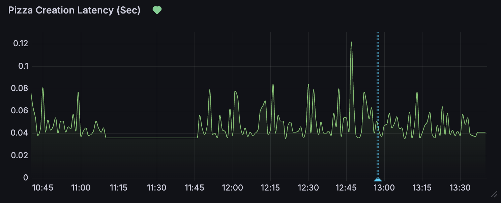
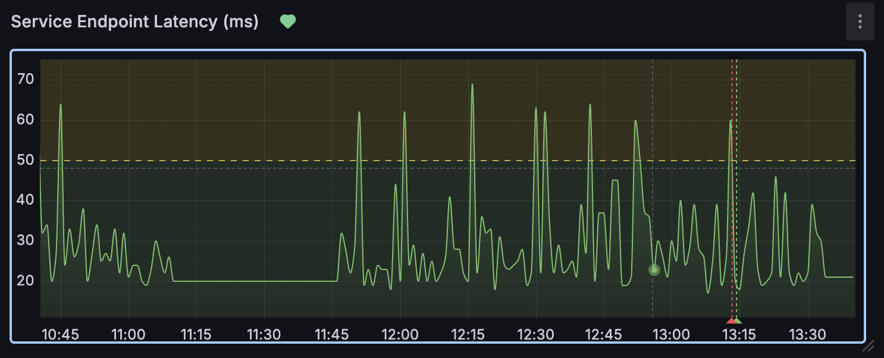
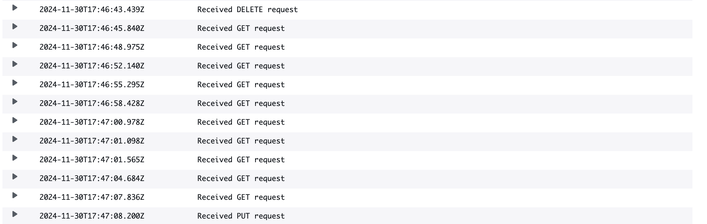

# Incident Report

## Summary
We received an unusually high number of pizza orders at 12:47 PM. This caused a spike in latency for ordering pizzas on the site and may have caused slowdowns for users at that time. Before and since that time, latency has been back to normal.

## Detection
We had an alert note the unusually high latency. Our OnCall team quickly responded to the incident and searched for the cause of the incident. We noticed a large number of bulky GET requests around the incident time as shown in both Grafana logs and AWS Cloudwatch.

## Impact
This may have impacted users briefly if trying to order pizzas or get back their final pizza price and result. We apologize to those affected by the slowdown. The majority of customers were not affected by this incident.  

## Timeline
1. The problem was first noticed at 12:47 PM Eastern time. 
2. Our OnCall Team was notified and within the hour were investigating the problem.
3. The OnCall Team found large GET requests with large orders

## Root cause analysis and Resolution
Large orders (above our normal expected average) may cause site slowness for all users. If users try to order an inordinate number of pizzas (say 500 or so) the latency would spike and users would be affected in a more drastic way. As a result, we are planning on implementing a prevention plan (see below).

## Prevention and Action items
Those who create large orders (say 20 pizzas or more) may slow down the API latency for all users. Since this is the case, we plan on parallelizing large orders (breaking our API call into smaller chunks) so that the whole process is quicker for the Api and the end user.
